Cuando escogemos como tipo de proyecto "ESP32 STEAMakers S3 + TFT" en el menú "Visualización tenemos la opción de "Pantalla TFT" que ofrece los siguientes bloques:

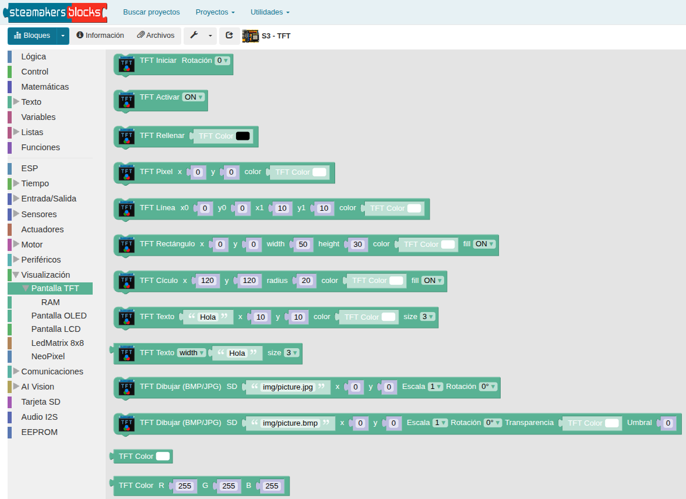{.center-img100}

En "Pantalla TFT" también tenemos la entrada "RAM" que presenta los siguientes bloques:

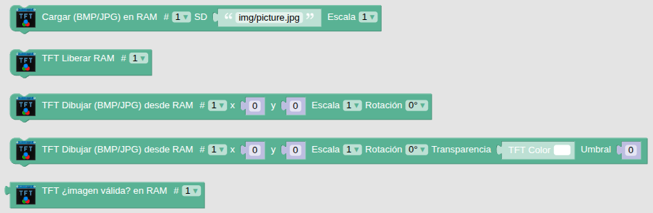{.center-img100}

Vamos a describir brevemente cada uno de ellos y daremos programas de ejemplo para los mismos.

## **Bloque Inicializar**
Inicialización con la rotación elegida.

Bloque de un solo uso obligatorio en el bloque ‘Inicializar’

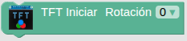{.center-img33}

Realiza las tareas necesarias para trabajar con la pantalla TFT. Debe ejecutarse al menos una vez en el bloque Inicializar o setup().

El bloque inicializa la pantalla y establece el ángulo en el que deseamos mostrar los datos, permitiendo así trabajar en formato normal o apaisado y la orientación deseada.

En STEAMakersBlocks trabaja con la librería Adafruit_ST7789.h

⇒ ==**Ejemplo inicialización y rotación**==

- [x] [**Descargar programa P01_inic_rotar**](../SMB/prog/P01_inic_rotar.abp)

| Programa | Resultado |
|---|---|
|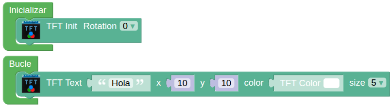 |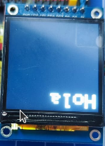 |
|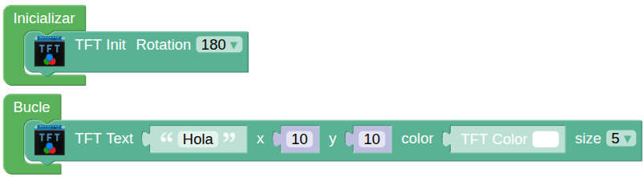 |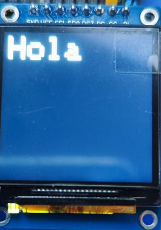 |
|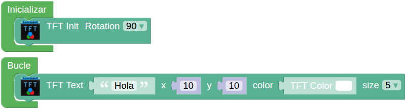 |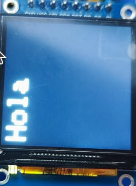 |
|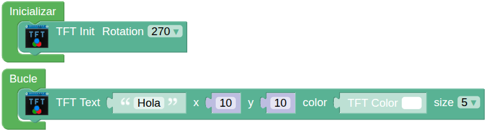 |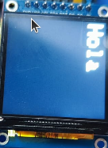 |

## **Retroiluminación**
En la librería los comandos que controlan el pin físico de retroiluminación (backlight) de la pantalla son:

* **backlight(1)**: Enciende los LEDs traseros del panel (luz encendida).
* **backlight(0)**: Apaga los LEDs traseros (pantalla a oscuras).

El bloque Retroiluminación, Backlight o Activación es:

{.center-img33}

La utilidad de este bloque radica en:

1. **Ahorro de energía**: Apagar la retroiluminación es la forma más rápida de reducir el consumo de batería de tu proyecto sin apagar el microcontrolador.
2. **No borra datos**: Alternar estos comandos no borra lo que hay en la pantalla; simplemente hace que sea visible o invisible para el ojo humano.

⇒ ==**Ejemplo de retroiluminación**==

- [x] [**Descargar programa P02_backlight**](../SMB/prog/P02_backlight.abp)

El programa hace parpadear el mensaje en pantalla. Se muestra el mensaje 1 segundo y se pasa el estado a ON (desactiva la retroiluminación por ser activo a nivel bajo) espera 2 segundo y se pone en OFF (activa la retroiluminación) volviendo a ser visible el mensaje durante 1 segundo, y así sucesivamente.

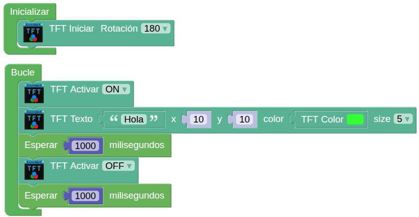{.center-img75}

En la animación se ve el funcionamiento del programa:

{.center-img}

## **Fondo de pantalla**
Se trata del color de fondo o relleno de pantalla (Fill). El color se selecciona de la paleta siguiente haciendo clic sobre el cuadrado de color negro:

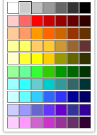{.center-img33}

El bloque para establecer el color de fondo de la pantalla es:

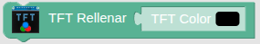{.center-img}

⇒ ==**Ejemplo fondos pantalla**==

- [x] [**Descargar programa P03_fondoPantalla**](../SMB/prog/P03_fondoPantalla.abp)

En el ejemplo anterior vamos a cambiar los bloques de retroiluminación por este bloque y establecer como colores de fondo blanco y negro.

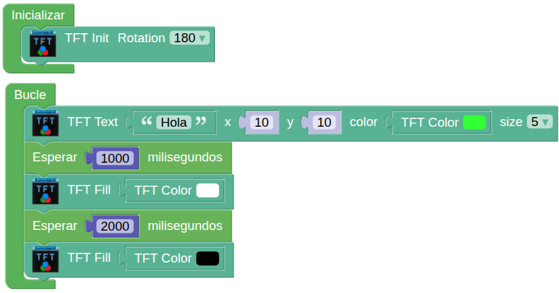{.center-img75}

El efecto ahora será que el texto se muestra cuando el fondo es negro y no se muestra cuando el fondo es blanco. Observamos así la diferencia entre los bloques Backlight y Fill.

{.center-img}

## **Dibujo de pixeles**
El bloque que dibuja el pixel de coordenadas (x,y) del color establecido es:

{.center-img}

⇒ ==**Ejemplo de dibujo de pixeles**==

- [x] [**Descargar programa P04_dibuja pixel**](../SMB/prog/P04_dibuja pixel.abp)

El programa siguiente va a dibujar cada 3 segundos dos patrones rectangulares de pixeles de dos colores diferentes dejando en blanco un número aleatorio de líneas entre cada línea.

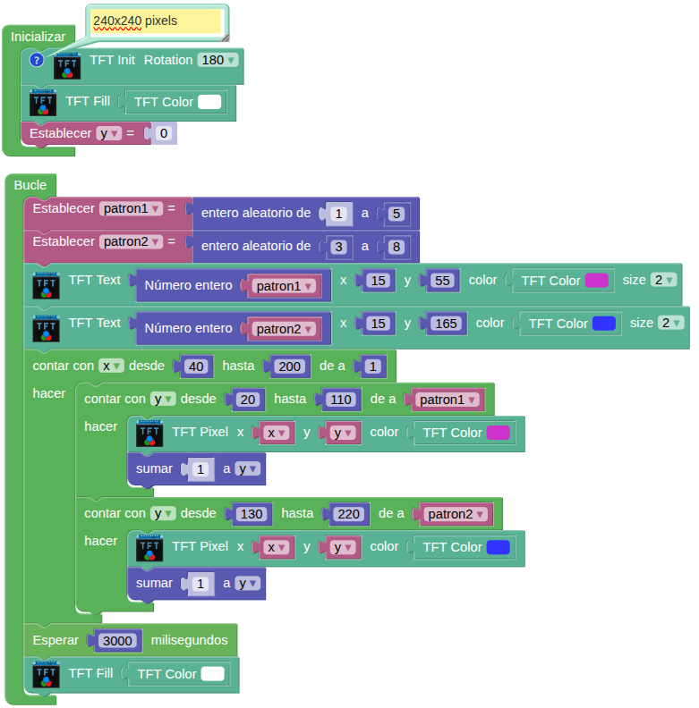{.center-img75}

El funcionamiento es el siguiente:

{.center-img}

## **Dibujo de líneas**
El bloque que dibuja una línea entre los puntos de coordenadas (x0,y0) y (x1,y1) es:

{.center-img75}

⇒ ==**Ejemplo de dibujo de líneas**==

- [x] [**Descargar programa P05_dibuja lineas**](../SMB/prog/P05_dibuja lineas.abp)

El programa siguiente dibujará 50 líneas de color azul desde unas coordenadas (x0,y0) aleatorias hasta la coordenada (10,10). El proceso se repite cada 2 segundos desde una pantalla con fondo gris claro.

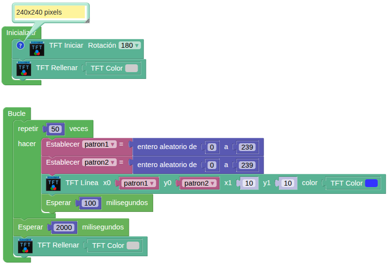{.center-img100}

El funcionamiento es el siguiente:

{.center-img}

## **Dibujo de rectángulos**
El bloque dibuja un rectángulo a partir de las coordenadas (x,y) dadas, de la altura y anchura indicadas y en el color elegido. El rectángulo se rellena si fill está en ON o solamente se dibuja el perímetro si está en OFF. El bloque es:

{.center-img75}

⇒ ==**Ejemplo de dibujo de rectángulos**==

- [x] [**Descargar programa P06_dibuja rectangulo**](../SMB/prog/P06_dibuja rectangulo.abp)

El programa siguiente dibuja 10 rectángulos de 60x50 px en color verde en coordenadas (x,y) definidas por patrones aleatorios. Dichos rectángulos se rellenan a la mitad en color azul. El proceso se repite tras una espera de 2 segundos.

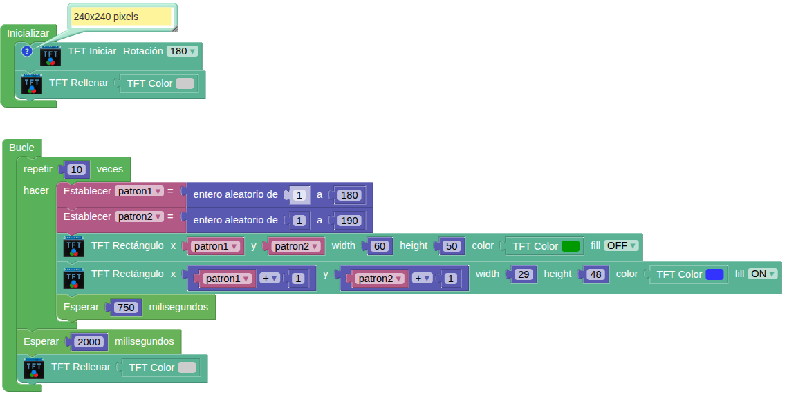{.center-img100}

El funcionamiento es el siguiente:

{.center-img}

## **Dibujo de círculos**
El bloque dibuja un círculo a partir de las coordenadas (x,y) dadas, del radio indicado en el color elegido. El círculo se rellena si fill está en ON o solamente se dibuja el perímetro si está en OFF. El bloque es:

{.center-img75}

⇒ ==**Ejemplo de dibujo de círculos**==

- [x] [**Descargar programa P07_dibuja circulos**](../SMB/prog/P07_dibuja circulos.abp)

El programa siguiente dibuja 10 círculos de radio 40 en color verde sin relleno y 10 círculo de radio 20 rellenos de color rojo cada dos segundos en posiciones aleatorias. Cada vez que se inicia el programa se muestra un punto de radio 100 de color magenta centrado en la pantalla.

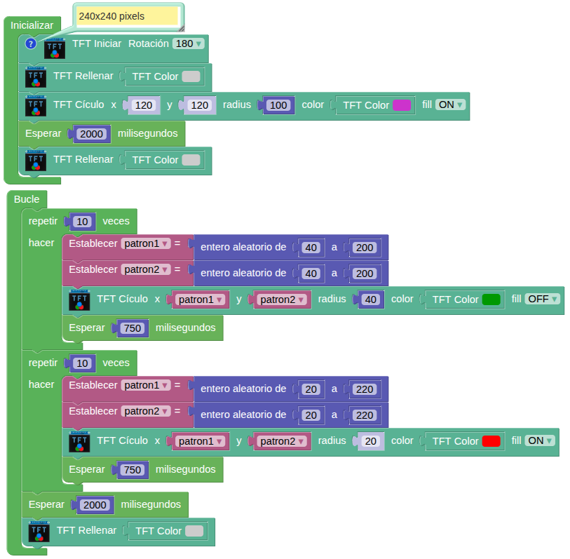{.center-img100}

El funcionamiento es el siguiente:

{.center-img}

## **Texto**
El bloque que dibuja el texto introducido a partir de las coordenadas (x,y) dadas, en el color elegido y del tamaño seleccionado es:

{.center-img75}

El tamaño puede variar entre 1 y 8.

Relacionados con texto existe un bloque que permite obtener la anchura o la altura del texto indicado a partir del tamaño especificado.

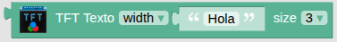{.center-img75}

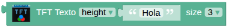{.center-img75}

El tamaño refiere el número de pixeles que ocupa un punto y el tamaño del carácter se establece por el número de pixeles que ocupa coincidiendo el grosor del trazo (en pixeles) con el del tamaño elegido. La siguiente tabla aclara esto:

|Tamaño|Grosor (px)|Ancho (px)|Alto (px)|
|:-:|:-:|:-:|:-:|
|1|1|5|7|
|2|2|10|14|
|3|3|15|21|
|4|4|20|28|
|5|5|25|35|
|6|6|30|42|
|7|7|35|49|
|8|8|40|56|

En la imagen siguiente se representa la forma en que se dibuja el cero en tamaños 1 y 2:

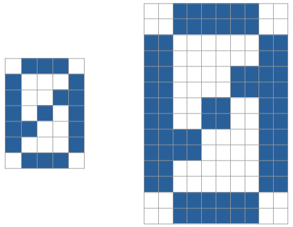{.center-img}

⇒ ==**Ejemplo de tamaño de texto**==

- [x] [**Descargar programa P08_text_size**](../SMB/prog/P08_text_size.abp)

El programa siguiente escribe en pantalla números del 1 al 8 que se corresponden con el tamaño.

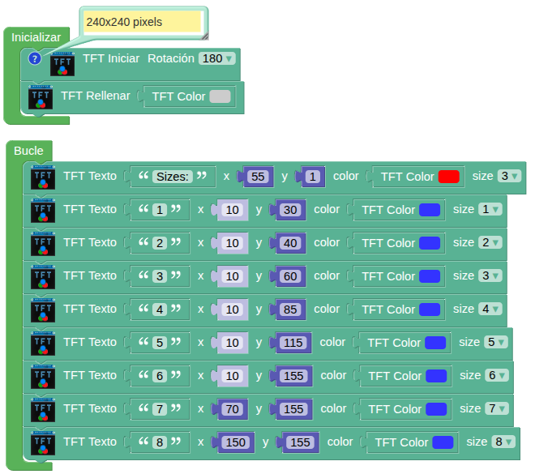{.center-img100}

El funcionamiento es el siguiente:

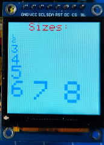{.center-img33}

⇒ ==**Ejemplo de centrado de texto**==

- [x] [**Descargar programa P09_centrado_texto**](../SMB/prog/P09_centrado_texto.abp)

En el ejemplo siguiente se muestra una cadena de texto centrada en la pantalla a partir de calcular la anchura y la altura del texto.

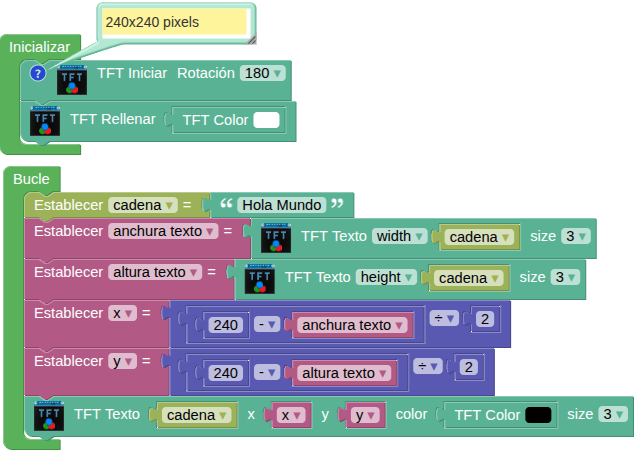{.center-img100}

El funcionamiento es el siguiente:

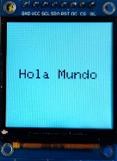{.center-img33}

## **Dibujar (BMP/JPG) SD**
El bloque que permite leer un archivo de la tarjeta SD y dibujarlo en pantalla es:

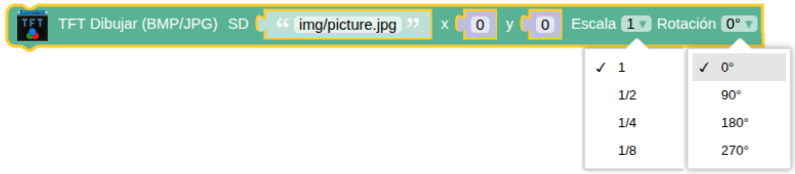{.center-img75}

Dibuja el archivo .BMP o .JPG especificado por la ruta y el nombre a la escala indicada y con la rotación que se decida.

⇒ ==**Ejemplo de muestra de imágenes grabadas en microSD**==

- [x] [**Descargar programa P10_imagenSD**](../SMB/prog/P10_imagenSD.abp)

En el ejemplo siguiente se muestran tres imágenes diferentes a distintas escalas y con distintas rotaciones.

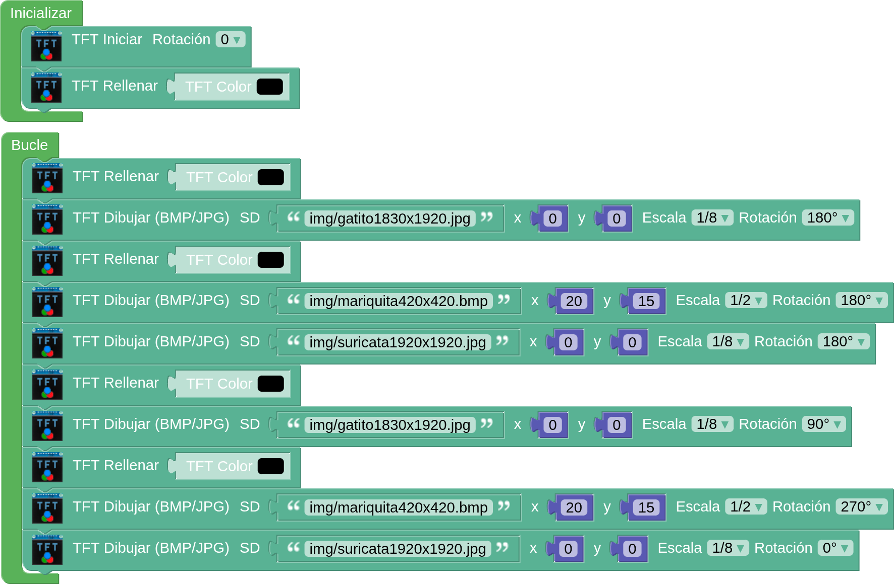{.center-img75}

Si quieres utilizar estas mismas imágenes te las puedes [descargar](../img/SMB/images.zip) comprimidas desde este enlace.

El funcionamiento del programa lo vemos a continuación:

{.center-img}

## **Dibujar (BMP/JPG) SD con transparencia**
El bloque que permite leer un archivo de la tarjeta SD y dibujarlo en pantalla es:

{.center-img100}  

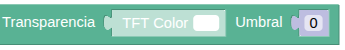{.center-img}

Al igual que el bloque anterior, dibuja el archivo .BMP o .JPG especificado por la ruta y el nombre a la escala indicada y con la rotación que se decida. Además se ha añadido la capacidad de elegir un color que se hará transparente con el umbral (threshold) indicados.

⇒ ==**Ejemplo de muestra de imágenes grabadas en microSD**==

- [x] [**Descargar programa P11_imagenSDTransp**](../SMB/prog/P11_imagenSDTransp.abp)

En el ejemplo siguiente se van mostrando las imágenes del gatito, la mariquita y el suricata, en distintas orientaciones, diferentes colores y niveles de transparencia y diferentes colores de fondo o relleno.

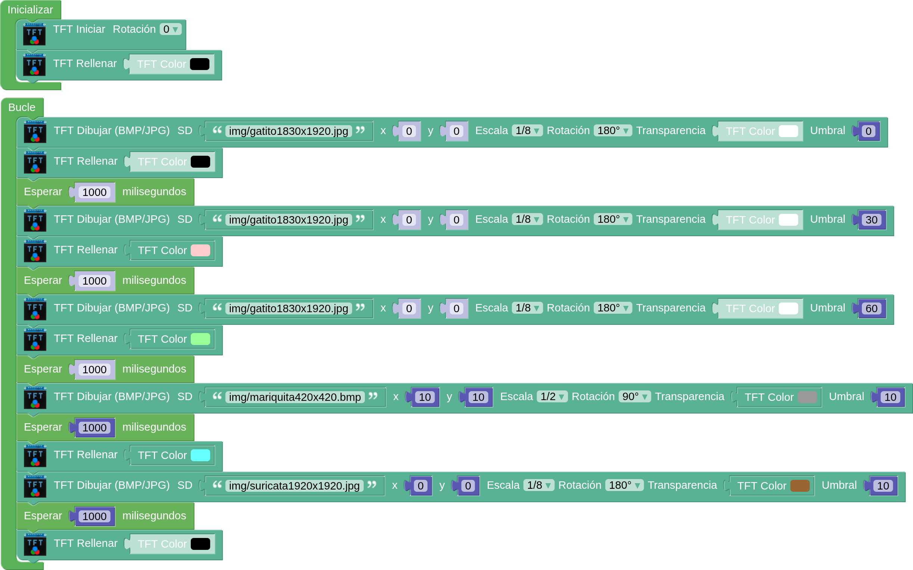{.center-img75}

El funcionamiento del programa lo vemos a continuación:

{.center-img}

## **Color y color RGB**
Las librerias utilizadas trabajan en RGB565 para la pantalla TFT-SPI-ST7788 por los motivos indicados de profundidad de color y latencia en [RGB565 / RGB888](https://fgcoca.github.io/STEAMakers_S3_AI/SM_S3/acerca_RGB/).

El bloque "TFT Color" permite escoger un color de la paleta.

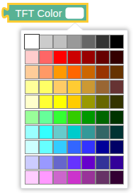{.center-img33}

El bloque "TFT Color RGB" permite establece el color a partir de los valores RGB dados..

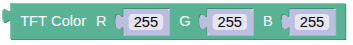{.center-img}

⇒ ==**Ejemplo de color**==

- [x] [**Descargar programa  P12_color_RGB**](../SMB/prog/ P12_color_RGB.abp)

El programa siguiente solicita vía consola serie los valores RGB para almacenarlos en sus correspondientes variables y mostrar un rectángulo en la pantalla del color correspondiente. Posteriormente se realiza el cálculo del RGB565 que se guarda en su variable mostrando en pantalla su valor decimal y hexadecimal así como un rectángulo igual al anterior con el RGB565 calculado.

Una vez grabado en la placa y activado el terminal serie, el programa requiere de un reset manual para que comenzar.

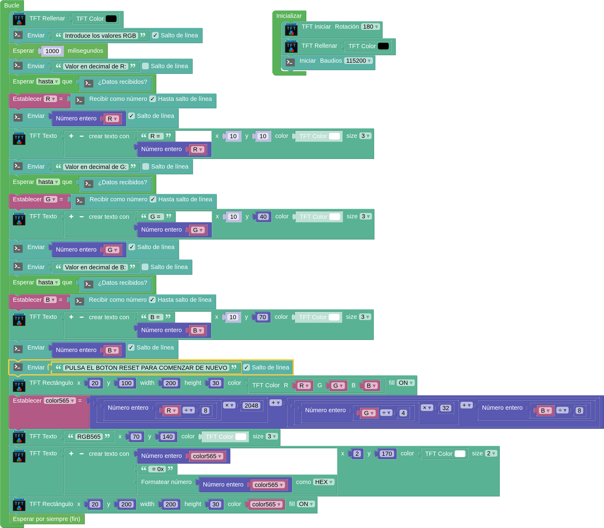{.center-img100}

La consola conectada y con los datos enviados por puerto serie se ve así:

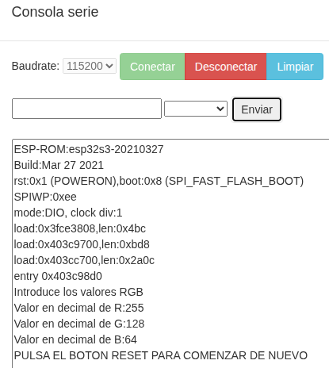{.center-img}

En la pantalla TFT irán apareciendo los datos enviados y tras el último se representarán los rectángulos y el valor RGB565 en decimal y hexadecimal.

El programa se detiene de forma permanente y para lanzarlo hay que hacer reset tras conectar la consola.

En la imagen siguiente vemos el resultado final y aunque no se aprecia bien (en la realidad si se aprecia) los dos rectángulos son exactamente del mismo color debido a que la librería trabaja siempre en RGB565.

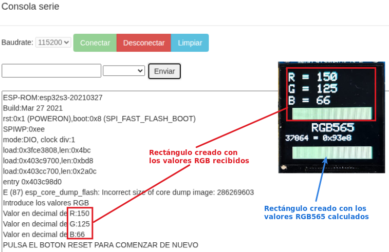{.center-img}

## **Trabajar con imágenes en la RAM**
Con los bloques anteriores hemos podido obsevar como la carga de las imágenes es algo lenta debido a la velocidad de lectura de la microSD y su representación en la pantalla, especialmente cuando tienen una resolución elevada y hay que utilizar el escalado.

A continuación se describen los bloques disponibles.

*  Cargar la imagen desde el directorio y el nombre especificados desde la microSD a la memoria RAM. Se pueden cargar un máximo de 4 imágenes. El escalado tiene el mismo efecto que en los bloques anteriormente descritos. Si se aplica el escalado en la carga en RAM no será necesario aplicarlo cuando la dibujemos en la pantalla.  
El bloque hay que ponerlo obligatoriamente en el bloque ‘Inicializar’ y lo podemos repetir hasta 4 veces.
*  Elimina de la memoria RAM la imágen asociada al número escogido.  
* 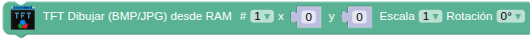 Funciona igual que el bloque “Dibujar (BMP/JPG) SD” pero lee la imagen de la memoria RAM siendo su carga y dibuja mucho más rápidos.  
* 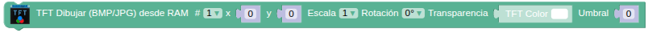 Funciona igual que el bloque “Dibujar (BMP/JPG) SD con transparencia” pero lee la imagen de la memoria RAM siendo su carga y dibuja mucho más rápidos.  
* 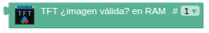 Para saber si la imágen asociada al número es una imagen válida.

⇒ ==**Ejemplo de imágenes en RAM**==

- [x] [**Descargar programa P13_imagenRAM**](../SMB/prog/P13_imagenRAM.abp)

El programa carga en el bloque "Inicializar" las tres imágenes en la RAM y luego va comprobando si la imagen es válida para mostrarla en cada caso. Si la imagen es válida se muestra tal cual está en la RAM con el ángulo y, en su caso, la transparencia correspondiente. Si la imagen no es válida se verá a pantalla completa una cruz negra sobre fondo blanco que se alterna cada segundo con una cruz blanca sobre fondo negro.

Debes observar como ahora la carga de imágenes es muy rápida y por eso se han puesto retardos de 2 segundos entre cada imagen.

También es importante observar que las escalas se han realizado en la carga en RAM para ahorrar memoria.

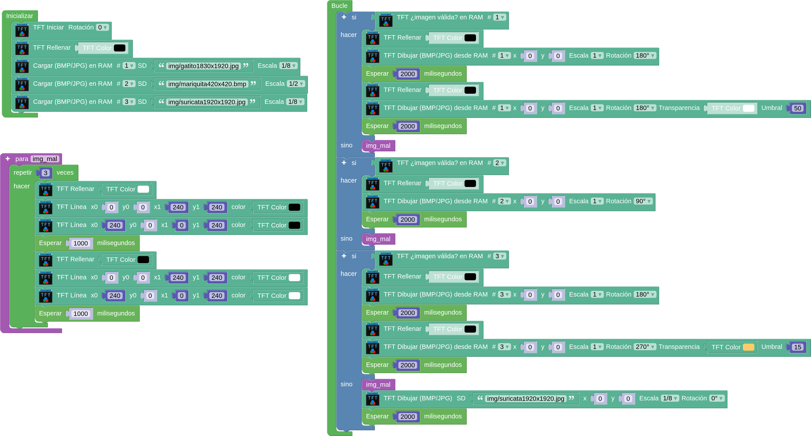{.center-img100}

El programa en funcionamiento lo vemos en la animación siguiente:

{.center-img}

⇒ ==**Ejemplo de imágen en SD y RAM**==

- [x] [**Descargar programa P14_imagenSDyRAM**](../SMB/prog/P14_imagenSDyRAM.abp)

El programa carga una imagen en la RAM en "Inicializar" y en el "Bucle" la muestra desde la RAM y desde la SD en distintas posiciones y umbrales de transparencia. Observa como en el dibujo desde SD no se ponen retardos.

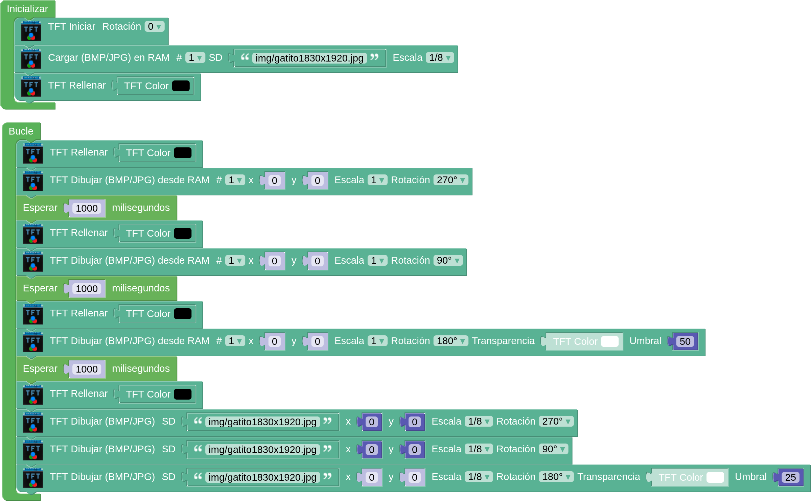{.center-img100}

El programa en funcionamiento lo vemos en la animación siguiente:

{.center-img}

