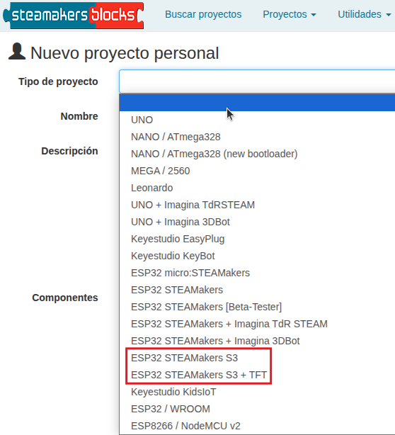

# Programación ESP32 STEAMakers AI con STEAMakersBlocks
Cuando creamos un proyecto en STEAMakersBlocks es fundamental seleccionar correctamente la placa con la que vamos a trabajar.

En el caso de la placa ESP32 STEAMakers AI tenemos dos opciones:

1. Trabajar con la placa sin Inteligencia Artificial.
2. Trabajar con IA. Requiere de TFT, micrófono y altavoz. Los pines D0 a D7 los ocupa la pantalla TFT.

En STEAMakersBlocks disponemos de dos tipos de proyecto para la placa que se adaptan a estas dos opciones:

  

Los proyectos tipo "ESP32 STEAMakers S3" están pensados para realizar cualquier proyecto de manera idéntica a los que se pueden hacer con la placa ESP32 ATEAMakers (la predecesora de STEAMakers AI) pero aprovechando las mejoras de características que tiene el nuevo procesador. En esta web no se va a trabajar con este tipo de proyecto, pero puedes encontrar información en estos enlaces:

* [Documentación realizada por mi](https://fgcoca.github.io/Contenidos/)
* [Libros y documentación](https://www.steamakersblocks.com/web/site/doc) disponible en "Recursos" de la web [STEAMakersBlocks](https://www.steamakersblocks.com/)

En esta documentación nos vamos a ocupar de los bloques relativo al segundo caso en el que tendremos bloques específicos para la placa ESP32 STEAMakers AI.
