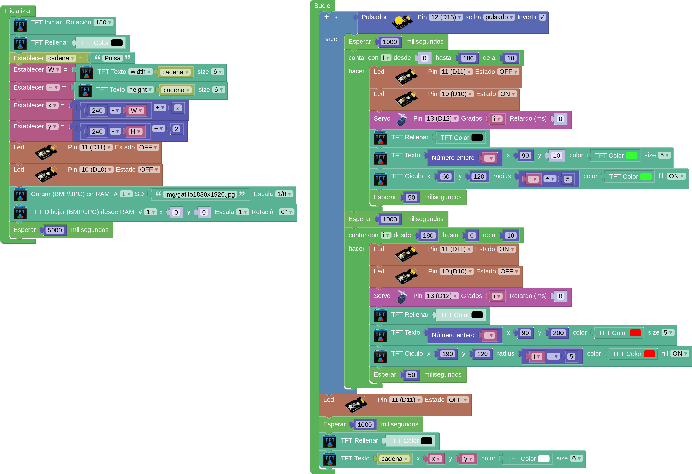

# **Reto TFT + sensores + actuadores**
Vamos a realizar un ejercicio sencillo que mezcle un poco de todo. En el inicio se carga en RAM y se muestra una imagen durante 5 segundos. En el bucle se controla que un servo gire en ambos sentidos cuando se acciona un pulsador. Mientra el servo gira se muestra en la pantalla TFT el ángulo que ha girado y se dibuja un círculo del mismo color. Se utiliza color verde para sentido horario y rojo para antihorario. Al mismo tiempo que el servo gira se enciende un LED del mismo color que el sentido de giro. Si no se acciona el pulsador en la pantalla se muestra el texto "Pulsa" invitando a dicha acción.

- [x] [**Descargar programa Reto_TFT_Sen_Act_Servo**](../SMB/prog/Reto_TFT_Sen_Act_Servo.abp)

El programa es:

{.center-img100}

El programa en funcionamiento lo vemos en la animación siguiente:

{.center-img75}
