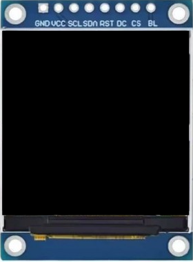
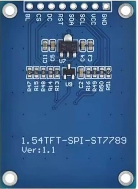

Un módulo de pantalla TFT que se usa con la STEAMakers S3 es el 1.54 TFT-SPI-ST7788:

  

La pantalla TFT ST7789 de 1,54 pulgadas suele utilizar un interfaz SPI de 4 hilos , aunque algunos clones etiquetan erróneamente los pines como "I2C" (SCL/SDA). El módulo estándar de 7 u 8 pines (resolución de 240x240) funciona mediante SPI por hardware para lograr la velocidad necesaria.

El [protocolo SPI](https://es.wikipedia.org/wiki/Serial_Peripheral_Interface) (Serial Peripheral Interface) es un estándar de comunicación serial síncrona, full-duplex y de alta velocidad, diseñado para la conexión rápida entre un microcontrolador (maestro) y periféricos (esclavos) a corta distancia. Utiliza 4 hilos (SCLK, MOSI, MISO, SS/CS) para transmitir datos simultáneamente en ambas direcciones, siendo ideal para sensores, pantallas y memorias.

## **Diagrama de pines SPI del ST7789 de 1,54"**

|Etiqueta|Función|Descripción|
|---|---|---|
|GND | Tierra|0 V |
|VCC |Alimentación |3,3 V o 5 V (se recomienda 3,3 V) |
|SCL / SCK |Reloj |Reloj serie SPI |
| SDA / SDI|SPI MOSI |Entrada de datos SPI (Salida maestra, entrada esclava) |
|RES / RST |Reiniciar |Reinicio activo a nivel bajo  |
| DC| Datos/Comando| Selección de datos/comandos|
|CS |Chip Select |Selección de chip activa a nivel bajo |
|BLK / BL |Backlight |Control de retroiluminación |

## **¿Por qué dice SDA/SCL si es SPI?**

* **SDA (Serial Data)**: En este módulo, es una línea de datos bidireccional de 1 solo hilo para SPI (3-wire SPI), pero casi todas las librerías lo usan como el pin MOSI estándar.
* **SCL (Serial Clock)**: Es simplemente el pin de reloj del bus SPI, equivalente a SCK.
