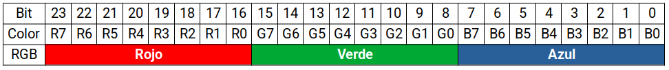
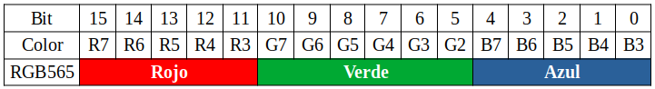

## **RGB565 frente a RGB888**
### Teoría base
Ambos formatos definen la profundidad de color en pantallas. La profundidad de color determina la cantidad de colores que una pantalla puede mostrar, se expresa en bits y determina el realismo y la suavidad de los degradados.

Si queremos almacenar o transmitir una imagen, debemos proporcionar información sobre cada píxel individual. Para las imágenes monocromáticas, esto se reduce a un solo bit de información, como por ejemplo las imágenes en pantallas LCD. Sin embargo, esto tiene la limitación de que solo podemos indicar si un píxel está encendido o apagado (por ejemplo, blanco o negro), pero nada más. Si queremos tener imágenes en color, también necesitamos información sobre el color. La **profundidad de color** define cuántos bits se utilizan para representar un color. Cuantos más bits, más colores podemos mostrar. Hay diferentes maneras de representar un color, pero prácticamente todas las pantallas utilizan RGB, donde un color se representa mediante sus componentes rojo (Red), verde (Green) y azul (Blue).

### RGB888
Una representación común de la información de color es el formato RGB888 o simplemente RGB, que utiliza (24 bits/3 bytes). Este formato define que disponemos de 8 bits/1 byte de información para cada color primario (rojo, verde y azul), lo que da como resultado el color deseado. Generalmente, el código de color se representa en dígitos hexadecimales porque que 1 byte equivale a exactamente 2 dígitos.

Un ejemplo sería la notación para el color amarillo es 0xFFFF00:

(R = 255 = 0xFF, G = 255 = 0xFF, B = 0 = 0x00)

Un color RGB888 con una profundidad de color de 24 bits se representa así en binario:

  

Los bits de la izquierda o mas significativos (**MSB**) tienen mayor importancia y, por lo tanto, influyen más en el color.

En esta profundidad de color cada pixel debe almacenar o transmitir 3 bytes, lo que consume bastante memoria y en sistemas como ESP32 o anteriores pueden generar latencia.

El RGB888 proporciona $2^{24}$ = 16777216 colores.

!!! Info "Latencia"
    La latencia es el retraso, medido en milisegundos, entre realizar realizar una acción y verla reflejada en la pantalla.

### RGB565
Es un formato de codificación de color de 16 (5+6+5) bits (2 bytes) por píxel, utilizado comúnmente en pantallas embebidas y sistemas integrados. Asigna 5 bits al rojo, 6 bits al verde y 5 bits al azul, lo que permite representar $2^{16}$ = 65536 colores. Se prefiere en dispositivos con memoria limitada porque equilibra una calidad de imagen aceptable con un menor uso de recursos.

Un color RGB565 con una profundidad de color de 16 bits se representa así en binario:

  

Detalles clave:

* **Distribución de bits**: Rojo (bits 15-11), Verde (bits 10-5), Azul (bits 4-0).
* **¿Por qué 6 bits para el verde?** El ojo humano es más sensible a las variaciones de color verde, por lo que se le asigna un bit adicional para mejorar la calidad visual. Mas información en [Stack Overflow](https://stackoverflow.com/questions/25467682/rgb-565-why-6-bits-for-green-color) y [Wikipedia](https://en.wikipedia.org/wiki/List_of_monochrome_and_RGB_color_formats).
* **Uso**: Frecuente en pantallas TFT, interfaces gráficas de tipo Arduino y sistemas embebidos.
* **Ventaja**: Requiere menos ancho de banda y menos memoria que el formato RGB888 de 24 bits, lo que es ideal para microcontroladores. Puedes ampliar información al respecto en el [Blog de Forlinx Embedded](https://www.forlinx.net/industrial-news/difference-between-rgb565-and-rgb888-423.html) y en [Panox Display](https://www.panoxdisplay.com/es/solution/WorkLCD.html).

La estructura del Píxel (16 bits) es:

RRRRR GGGGGG BBBBB (5 bits R, 6 bits G, 5 bits B).

Al convertir de RGB888 a RGB565, se pierden datos, lo que puede provocar un ligero oscurecimiento o cambio de tono, ya que los 3 bits inferiores de cada canal se eliminan.

### Convertir RGB888 a RGB565
Para trabajar con este formato, existen herramientas como el [RGB565 Color Picker for LCD](https://trolsoft.ru/en/articles/rgb565-color-picker) o [RGB565 Color calculator](http://www.rinkydinkelectronics.com/calc_rgb565.php).

Recordemos las principales diferencias entre RGB888 y RGB565:

* **RGB888**: 8 bits por cada color → 24 bits total (R: 0–255, G: 0–255, B: 0–255).
* **RGB565**: Rojo: 5 bits (0–31), Verde: 6 bits (0–63), Azul: 5 bits (0–31), Total: 16 bits.

Para convertir RGB888 → RGB565 lo que se hace es reducir la precisión de cada componente:

* Rojo: 8 bits → 5 bits (se coloca en los bits 11–15)
* Verde: 8 bits → 6 bits (se coloca en los bits 5–10)
* Azul: 8 bits → 5 bits (se coloca en los bits 0–4)

Vamos a convertir el FF8040  a RGB565:

Entrada:

            R = 255 → 11111111 → FF
		    G = 128 → 10000000 → 80
		    B = 64  → 01000000 → 40

Ahora realizamos el recorte de los bits menos significativos:

            R = 11111
		    G = 100000
		    B = 01000

Procedemos a colocar cada grupo en su lugar (desplazamiento a la izquierda):

		    R: 11111 << 11  → 11111 000000 00000
		    G: 100000 << 5  → 00000 100000 00000
		    B: 01000        → 00000 000000 01000

Y ahora combinamos:

			11111 000000 00000
			00000 100000 00000
			00000 000000 01000
			------------------
			11111 100000 01000

Por tanto el resultado final en RGB565 es 64520 = 0xFC08 :

        1111110000001000:
 			111111000 → 252 → FC
			00001000 → 08 → 08

Una equivalencia de colores la podemos encontrar en [16-bit (rgb-565) color name definitions](https://github.com/newdigate/rgb565_colors?tab=readme-ov-file#pink).

Existe una forma rápida de conversión sin necesidad de utilizar binario, para lo que:

* **Paso 1: “comprimir” cada color**

Dividir cada color entre 8 para 5 bits y entre 4 para 6 bits, quedándonos con la parte entera:

🔴 Rojo: R / 8 → (porque 256 / 8 = 32)  
🟢 Verde: G / 4 → (porque 256 / 4 = 64)  
🔵 Azul: B / 8 →(porque 256 / 8 = 32)

* **Paso 2: usar pesos fijos**

Ahora aplicas esta fórmula directa utilizando los valores ya reducidos:

RGB565 = (R * 2048) + (G * 32) + B

Resolvemos el mismo ejemplo con:

		    R = 255
		    G = 128
		    B = 64

* **Paso 1: reducir**

		    R = 255 / 8 = 31,875 = 31
		    G = 128 / 4 = 32
		    B = 64  / 8 = 8

* **Paso 2: fórmula**

RGB565 = (31 × 2048) + (32 × 32) + 8 = 63488 + 1024 + 8 = 64520 = 0xFC08

En resumen, se trata de dividir y multiplicar:

		    R → ÷8 → ×2048
		    G → ÷4 → ×32
		    B → ÷8
