## **Conceptos base**
Las siguientes explicaciones se dan para el programa [GIMP](http://gimp.org.es/), el Software Libre de manipulación de imágenes de [GNU](https://www.gnu.org/home.es.html) que empleo habitualmente. Se utilizarán las imágenes [art002e009288](https://www.nasa.gov/image-detail/art002e009288/) y [jsc2026e020490](https://www.nasa.gov/image-detail/amf-jsc2026e020490/) descargadas de [Artemis II Lunar Flyby](https://www.nasa.gov/gallery/lunar-flyby/) dentro de los recursos [multimedia Artemis II](https://www.nasa.gov/artemis-ii-multimedia/) de la [NASA](https://www.nasa.gov/).

La información completa está disponible en la documentación en español de GIMP en su [Manual de usuario](https://docs.gimp.org/es/).

En concreto vamos a ver someramente algunos de los conceptos asociados al menú imagen con la finalidad de optimizar el tamaño de las imágenes en la **microSD** para proceder a redimensionarlas al tamaño adecuado (necesario) para nuestros propósitos.

Esta tarea es conveniente realizarla antes de grabarlas en la **microSD**, dado que las imágenes en RAM ocupan mucho y pueden provocar "**guru meditatio**n" en el ESP32 provocando que se cuelgue y reinicie.

También vamos a revisar los conceptos aplicados a GIMP sobre los formatos de imágen soportados en los bloques, es decir formato **BMP** y formato **JPEG**.

### Guru Meditation Error
Un "**Guru Meditation Error**" en ESP32-S3 es un fallo crítico o de pánico del sistema (panic) que indica un fallo grave, generalmente relacionado con el acceso ilegal a la memoria, desbordamiento de pila (stack overflow) o un puntero nulo. Al trabajar con imágenes BMP o JPG en pantallas TFT, este error es común si no se gestiona correctamente la memoria o la carga de archivos.

**1. Causas Comunes del "Guru Meditation" con Imágenes**
    
* **Falta de Memoria (Heap/Stack)**: Cargar imágenes JPG o BMP muy grandes en la RAM provoca que el ESP32 se quede sin memoria. El ESP32-S3 tiene mucha capacidad, pero las imágenes grandes siguen siendo un problema.
* **Punteros Nulos (Null Pointers)**: Intentar dibujar una imagen que no se ha cargado correctamente (por ejemplo, si no se encuentra en la tarjeta SD).
* **Problemas de SPI (TFT_eSPI)**: Configuración incorrecta de los pines CS (Chip Select) o DC (Data/Command) en el archivo User_Setup.h, lo que provoca errores de acceso a memoria. Conectando la TFT en la tira de pines hembra destinados a ello en la STEAMakers S3 no se puede dar esté caso siempre que los pines de la pantalla tengan el mismo orden que el de la tira de pines (GND, VCC, SCL, SDA, RST, DC, CS y BL leidos de izquierda a derecha por el frontal y con los USB orientados a la izquierda).
* **Archivo de Imagen Corrupto**: Intentar mostrar un archivo que no es un BMP/JPG válido o que está dañado.

**2. Cómo Mostrar Imágenes BMP/JPG y Evitar el Error**

Pasos clave:

* **Formato de Imagen**: Asegúrate de que las imágenes BMP sean de 24 bits para Windows y que JPG sea baseline (no progresivo), adaptados a la resolución de tu pantalla de 240x240.
* **Uso de Tarjeta SD**: Guarda las imágenes en una tarjeta MicroSD (formateada en FAT32).
* **Pinout**: Verifica que los pines de la SD y de la pantalla (TFT) no entren en conflicto.

### Tamaño del lienzo en GIMP
Se denomina lienzo al área visible de una imagen, que normalmente coincide con el tamaño de las capas. El comando permite agrandar o reducir el tamaño del lienzo pudiendo hacer lo mismo con el de las capas, si se desea. Cuando se agranda se crea un espacio libre alrededor de la imagen que se puede rellenar con transparencia o con color. Cuando se reduce, el área visible se recorta, quedando las capas extendidas fuera de los bordes del lienzo. Si existen capas de texto, estas se pueden redimensionar marcando la opción.

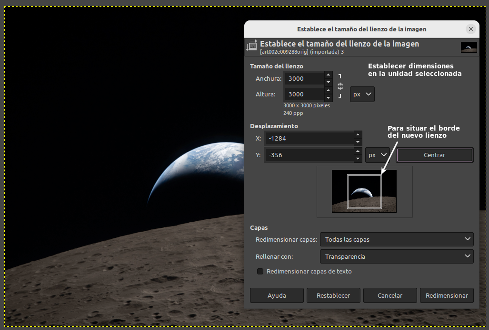  

El tamaño de lienzo resulta útil para:

* Añadir algo alrededor de una imagen. Se puede agrandar el tamaño del lienzo, añadir una capa nueva que tendrá el tamaño del nuevo lienzo y pintar en esta nueva capa.
* Recortar una imagen.

El eslabón de cadena junto a las dimensiones sirve para enlazar o desenlazar los cambios en las dimensiones.

El primer efecto que se consigue en este caso es reducir el tamaño en disco en disco:

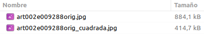  

### Tamaño de la impresión en GIMP
Comando que sirve para configurar la resolución de impresión de la imagen, lo que permite cambiar las dimensiones de una imagen impresa y su resolución sin cambiar el número de pixeles en la imagen.

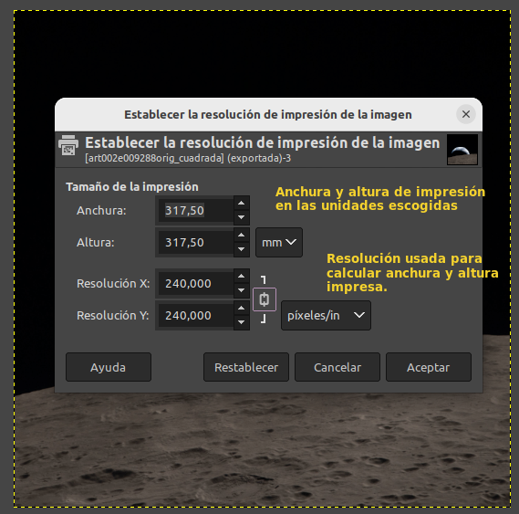  

La resolución de la salida determina el número de píxeles usados por la unidad de longitud para la imagen impresa. No hay que confundir la resolución de la salida con la resolución de impresión, que es una característica de la impresora que se expresa en dpi (puntos por pulgada).

La resolución mostrada en las cajas es la resolución de la imagen original. Si se incrementa la resolución de salida, la página impresa será más pequeña, debido a que se usan más píxeles por unidad de longitud. En consecuencia, y por la misma razón, redimensionar la imagen modifica la resolución.

Al incrementar la resolución se incrementa la nitidez de la página impresa. Esto es bastante diferente de una simple reducción del tamaño de la imagen al escalarla, ya que no se quitan píxeles ni información de la imagen.

### Escalar la imagen en GIMP
El comando reduce o amplia el tamaño físico de la imagen cambiando el número de pixeles que contiene. Cambia el tamaño del contenido de la imagen y redimensiona el lienzo.

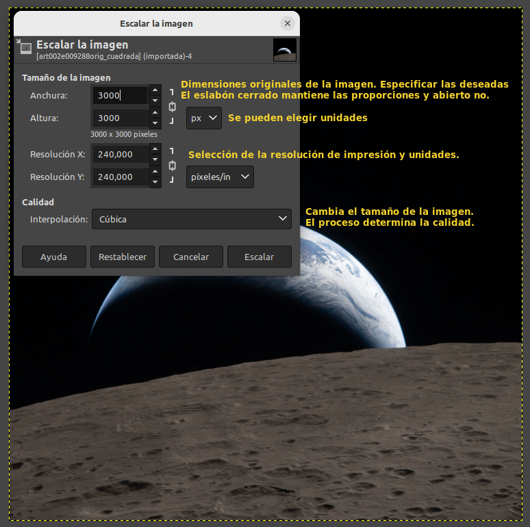  

Los métodos de interpolación que determinan la calidad de la transformación son:

* **Ninguno**. El color de cada píxel se copia desde su píxel vecino más cercano en la imagen original. Es el método más rápido pero provoca un efecto “diente de sierra” o pixelado y una imagen de peor calidad.

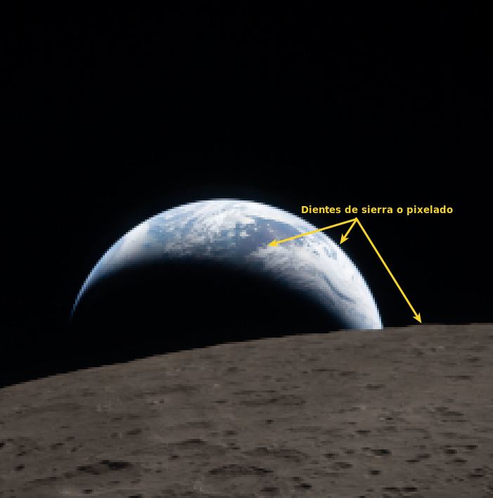  

* **Lineal**. El color de cada píxel se calcula como el color promedio de los cuatro píxeles más cercanos en la imagen original. Este método produce un resultado satisfactorio en la mayoría de las imágenes y es un buen compromiso entre velocidad y calidad.
* **Cúbica**. El color de cada píxel se calcula como el color promedio de los ocho píxeles más cercanos en la imagen original. Generalmente, produce el mejor resultado, pero necesita más tiempo. Este método se suele llamar **“Bicúbico”**.
* **LoHalo, NoHalo**. Halo es un artefacto que se puede crear por interpolación. Para minimizar el halo utilizar NoHalo y si se está reduciendo una imagen el mejor es LoHalo. Aunque esto son simplemente recomendaciones que no hay que tomar al pie de la letra. La siguiente imagen se escala a 960x960 px con resolución de 600 px/in con LoHalo.

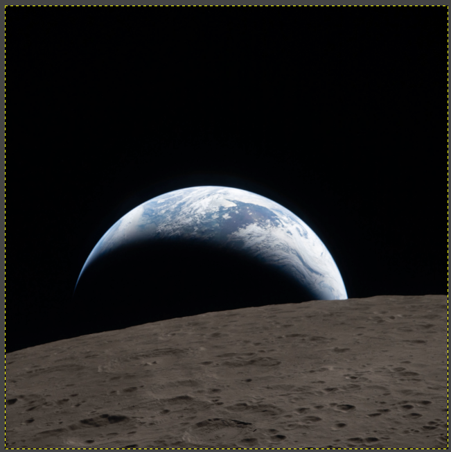  

### Recortar imagen en GIMP
En GIMP se pueden recortar imágenes de dos maneras:

* **Recortar a la selección**. Recorta la imagen al contorno seleccionado. En la imagen vemos una selección de 1920x1920px realizada sobre la imagen [*art002e009288orig_cuadrada*](../img/SM_S3/art002e009288orig_cuadrada.jpg).

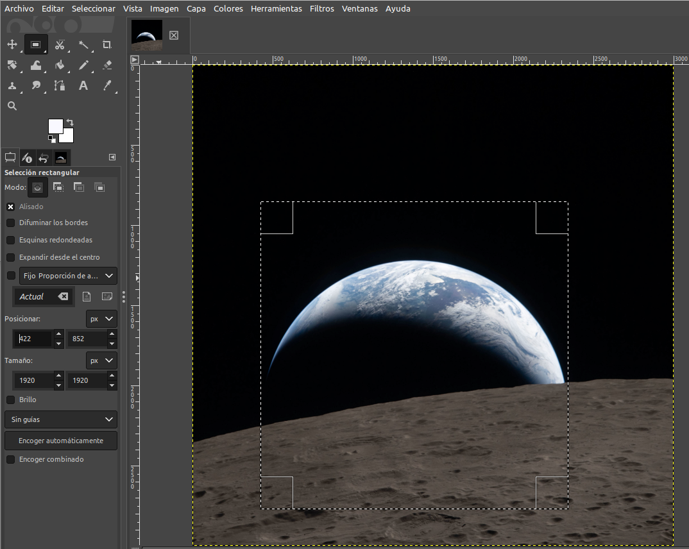  

A continuación vemos el acceso al comando y el resultado de aplicarlo:

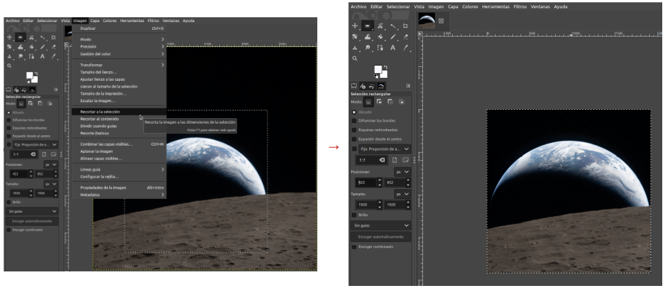  

* **Recortar al contenido**. Elimina los bordes de una imagen buscando en las capas el borde más amplio posible del área del color.
* 
El ejemplo de “Recortar al contenido” de la documentación [6.25. Crop Image → 6. The “Image” Menu](https://docs.gimp.org/3.0/en/gimp-image-crop.html) explica este tipo de recorte.

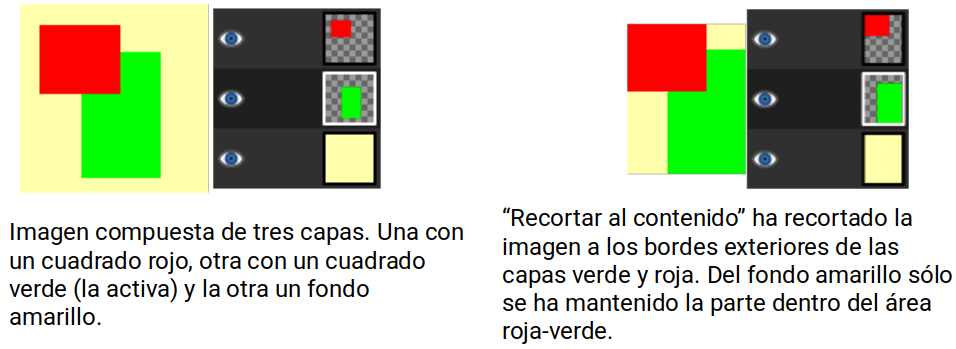  

## **Archivos en GIMP**
GIMP tiene capacidad de leer y escribir en una gran variedad de formatos gráficos utilizando complementos fácilmente ampliables. El formato nativo de archivo en GIMP es XCF y no es un complemento.

Cuando se abre una imagen jpg como por ejemplo [*art002e009288orig_cuadrada.jpg*](../img/SM_S3/art002e009288orig_cuadrada.jpg) GIMP pregunta si deseas convertir el perfil de color de la imagen al espacio de trabajo nativo de GIMP. Generalmente, seleccionar "Mantener" o "Convertir" no afectará drásticamente el resultado si solo vas a realizar ediciones básicas.

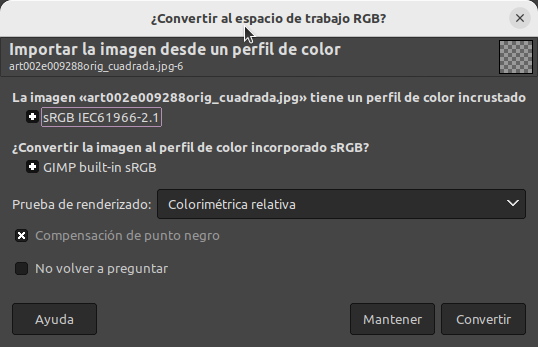  

El archivo “art002e009288orig_cuadrada.jpg” se importa como:

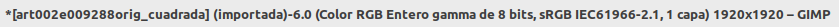  

El asterisco que precede al nombre indica que el archivo ha sido modificado.

### Formatos de archivo en GIMP
La mayoría de los formatos que se pueden importar se pueden también exportar.

El formato XCF es especial ya que almacena todo sobre una imagen a excepción de la información de “deshacer”.

GIMP permite exportar en gran variedad de formatos aunque solamente vamos a ver los implicados en los bloques TFT que son BMP y JPG. El único formato capaz de guardar toda la información de una imagen es el formato nativo XCF. El resto de formatos preserva algunas propiedades pero pierde otras y es imposible que GIMP sepa cual es la información perdida. Por este motivo cuando se cierra una imagen o al cerrar GIMP se muestre el diálogo siguiente:

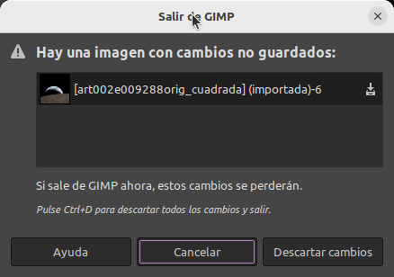  

### Exportar imagen como jpeg
Los archivos JPEG pueden tener como extensión .jpg, .JPG o .jpeg. Es un formato que comprime las imágenes de forma muy eficiente con un mínima pérdida de calidad. Ningún formato se aproxima en niveles de compresión pero en cambio no soporta transparencia ni multiples capas.

La ventana de diálogo de exportar a JPEG es:

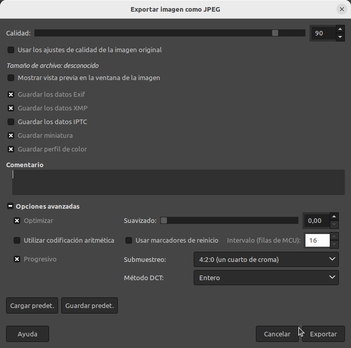  

Sin ánimo de entrar en detalles, sobre todo porque el algoritmo JPEG es muy complejo, vamos a ver  las opciones disponibles:

* **Calidad**. Tiene un rango de 0 a 100. Un valor entre 80 y 90 produce excelentes resultados, aunque en algunos casos esta calidad se puede ajustar a valores diferentes. En la imagen siguiente, la imagen de la izquierda está exportada a 50 y la de la derecha a 95.

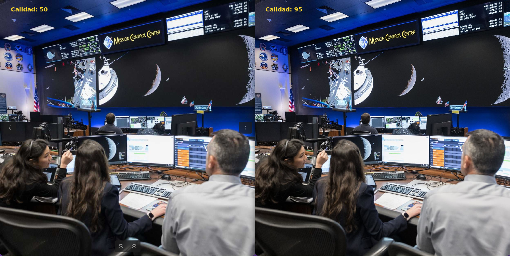  

* **Usar los ajustes de calidad de la imagen original**. Si la imagen adjuntó ajustes de calidad particulares (tablas de cuantización) esta opción permite usarlos en lugar de los estándares, siempre que los ajustes que tiene el archivo sean mejores. Si no son mejores la opción estará disponible pero no activada. La opción se habilita para obtener al menos la misma calidad y tamaño de archivo.
* **Mostrar vista previa en la ventana de imagen**. Al marcar la opción los cambios se muestran en la pantalla de la imagen sin que se altere la misma. También se se muestra el tamaño aproximado del archivo.

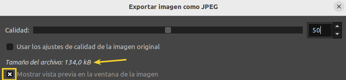  

* **Metadatos**. Si la imagen cargada tiene metadatos Exif, XMP, IPTC, estos se conservan o no en la exportación JPEG.
* **Guardar miniatura / Guardar perfil de color**. Para aplicaciones que usan una imagen en miniatura para disponer rápidamente de una vista previa de la imagen.
* **Comentario**. Para editar el existente o escribir uno nuevo.
* **Optimizar**. La optimización de parámetros de [codificación por entropía](https://en.wikipedia.org/wiki/Entropy_coding#:~:text=Two of the most common,static code may be useful.) será usada para obtener un archivo mas pequeño aunque requiere mas tiempo.
* **Suavizado**. La compresión JPEG divide una imagen en bloques pequeños y reduce la información de color y brillo en cada bloque para crear tamaños de archivo más pequeños. Los artefactos JPEG son distorsiones no deseadas que ocurren cuando una imagen se comprime utilizando el formato JPEG. Se puede establecer un valor entre 0 y 1 que suaviza la imagen al guardarla reduciendo los artefactos aunque provoca cierto desenfoque. Reduce el tamaño del archivo.
* **Utilizar codificación aritmética**. La codificación aritmética es un tipo de codificación por entropía (un método de compresión de datos sin pérdida) que se puede utilizar al exportar a formato JPEG. Las imágenes que utilizan la codificación aritmética pueden tener un tamaño entre un 5 % y un 10 % menor.
* **Usar marcadores de reinicio**. Se incluyen en la imagen para que esta se cargue por partes.
* **Intervalo (filas MCU)**. Las imágenes JPEG se almacenan como una serie de mosaicos cuadrados comprimidos llamados MCU (Minimum Coded Unit o Unidad Mínima de Codificación). En esta opción se puede establecer el tamaño de estos mosaicos (en píxeles) cuando se activa el uso de marcadores de reinicio.
* **Progresivo**. Si se activa los fragmentos de imagen se guardan en el archivo de forma que permita un perfeccionamiento gradual de la imagen durante la descarga web en una conexión lenta.
* **Submuestreo**. El ojo no es igual de sensible a todo el espectro de color. Se puede usar esto para la compresión del archivo. Los métodos disponibles son:

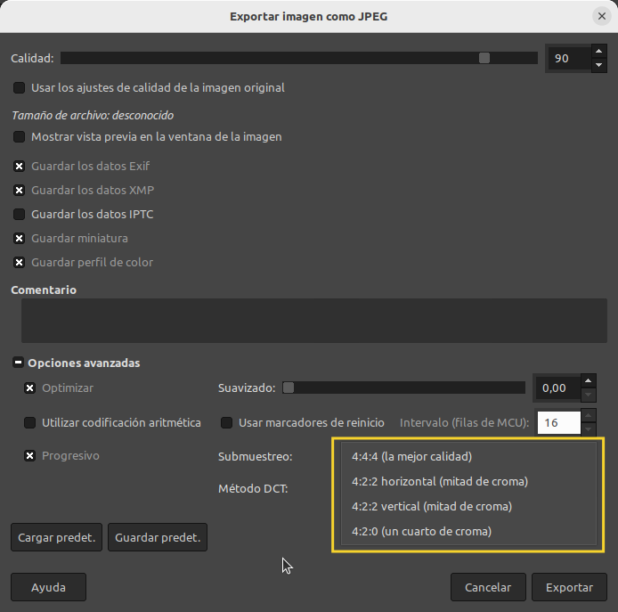  

◦ **4:4:4 (la mejor calidad)**: Preserva los bordes y el contraste de colores con la menor compresión.

◦ **4:2:2 horizontal (mitad de croma) / 4:2:2 vertical (mitad de croma)**: Muestreo estándar para una buena relación entre calidad de la imagen y tamaño del archivo.

◦ **4:2:0 (un cuarto de croma)**. Es el que produce los archivos mas pequeños pero con tendencia a desnaturalizar las imágenes.

* **Método DCT**. DCT (Discrete Cosine Transform o transformada discreta cosenoidal) constituye el primer paso del algoritmo JPEG para pasar del dominio espacial al dominio de la frecuencia. Las opciones disponibles son “float (coma flotante)”, “integer (entero)” que es la predeterminada y “fast integer (entero rápido)”.

    ◦ **float**: El método float es más preciso que el método integer, pero es mucho más lento.  
    ◦ **integer (el valor predeterminado)**: Este método es más rápido que float, pero no tan preciso.  
    ◦ **fast integer**: El método es mucho menos preciso que los otros dos.

### Exportar imagen como BMP
Para exportar una imagen como BMP de Windows en GIMP, ve a Archivo → Exportar como. Asigna un nombre terminado en .bmp o selecciona "Imagen BMP de Windows" en la lista de tipos de archivo, haz clic en "Exportar".

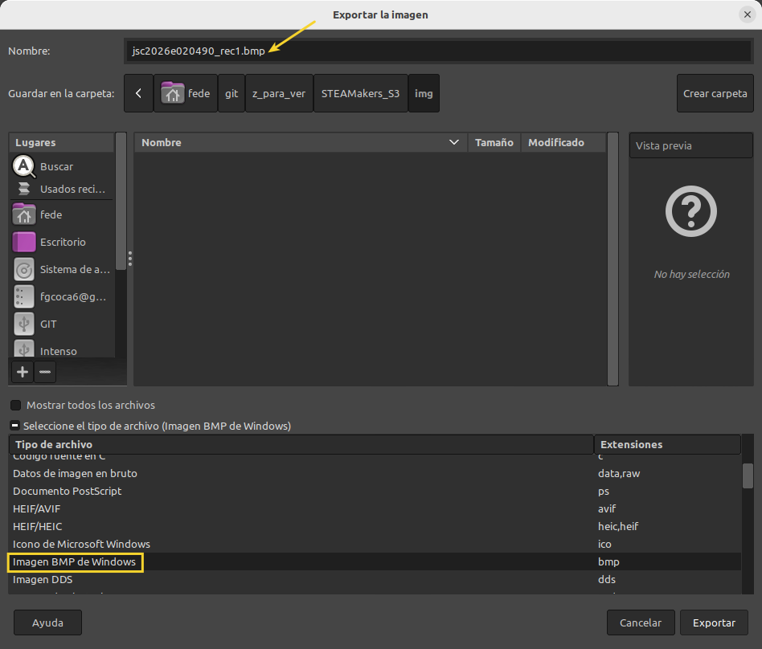  

Se abre la ventana “Exportar imagen como BMP” siguiente:

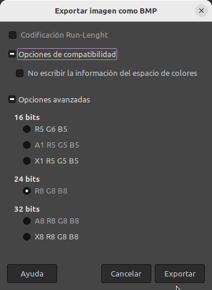  

El formato BMP no gestiona bien las transparencias; si tu imagen tiene fondo transparente, es recomendable aplanarla antes o esperar que GIMP la exporte sin canal alfa por defecto.

* **Codificacion run-lenght**: Al exportar como Windows BMP, puedes marcar la casilla para comprimir el archivo. Es especialmente efectivo en imágenes indexadas (con paleta de colores limitada).
* **Opciones de compatibilidad**: En las opciones avanzadas, puedes activar o desactivar "No escribir información del espacio de color" si vas a usar la imagen en programas muy antiguos que no reconozcan esos datos extra.
* **Opciones avanzadas**: para configurar la profundidad de bits específica (como 16, 24 o 32 bits) para tu archivo BMP.

    ◦ 16 bits: Ideal para archivos pequeños con degradados simples.  
    ◦ 24 bits: Es el estándar de alta calidad (8 bits por canal, sin transparencia).  
    ◦ 32 bits: Úsalo solo si necesitas incluir un canal alfa (transparencia) en el archivo BMP.

## **Reducir el tamaño del archivo**
Para conseguir reducir el tamaño de la imagen algo más, se puede convertir la imagen al modo indexado.

En el submenú “Modo” del menú “Imagen” se puede encontrar el comando junto con otros dos para cambiar el modo de color de la imagen.

Esto quiere decir que todos los colores se reducirán a sólo 256 valores. No es recomendable para fotografía.

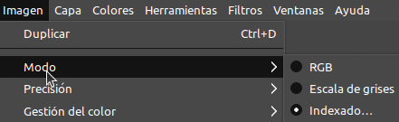  

Cuando se selecciona aparece la siguiente ventana:

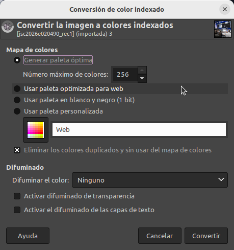  

Una vez configuradas las opciones haz clic en el botón “Convertir” y la imagen pasará a tener los colores indexados.

Si utilizas esta opción el tamaño de archivo será mas pequeño y el mismo para JPEG que para BMP.
