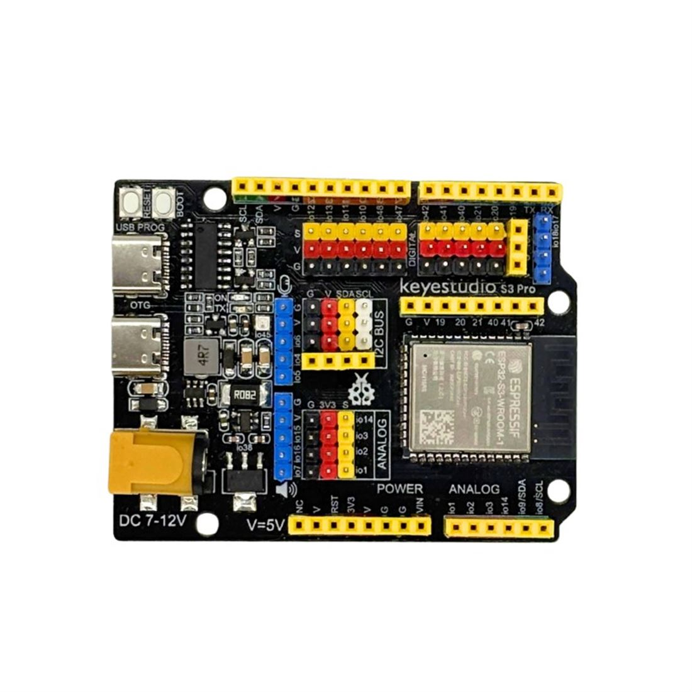

# **ESP32 STEAMakers AI**
La placa ESP32 STEAMakers AI es la evolución de la placa ESP32 STEAMakers, y está diseñada para llevar la inteligencia artificial al aula sin renunciar a la compatibilidad total con todo el material existente. Permite realizar los mismos proyectos que la versión anterior, utilizando los mismos sensores, actuadores y shields, pero añade mayor potencia y nuevas posibilidades gracias al nuevo microcontrolador ESP32-S3.

La ESP32 STEAMakers AI mantiene el formato compatible con Arduino UNO, lo que garantiza la compatibilidad con shields y accesorios ya utilizados en el aula.

Incorpora el microcontrolador ESP32-S3 WROOM-1, con mayor capacidad de procesamiento, memoria mejorada y un acelerador de hardware para IA, que permite ejecutar modelos sencillos de reconocimiento de voz, patrones o imágenes.

Permite acceder a la plataforma [ai.keyestudio.com](https://ai.keyestudio.com/login) mediante el número único de la placa, para comunicarse con la IA, ejecutar órdenes, analizar datos o controlar sensores y actuadores directamente desde el aula.

  

