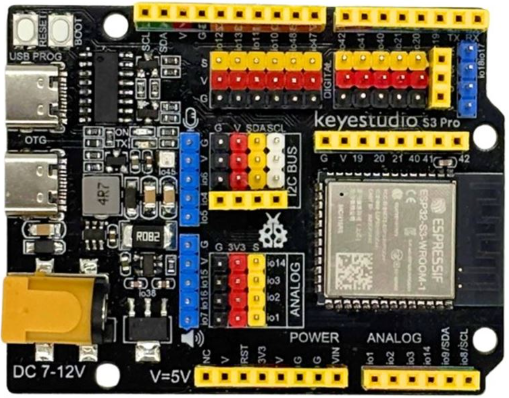
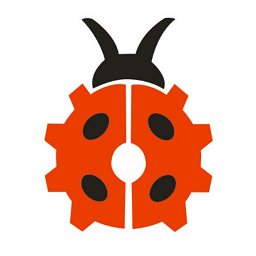
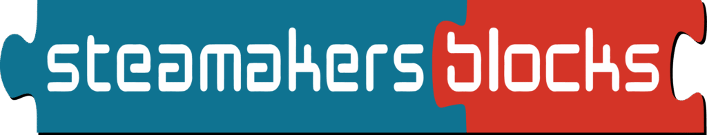

La placa **ESP32 STEAMakers AI** trabajará con la plataforma ai.keyestudio.com, que es la primera aplicación didáctica de la Inteligencia Artificial en el mundo maker.

{.center-img}

[***Descúbrela aquí***](https://shop.innovadidactic.com/ca/standard-placas-shields-y-kits/1716-keyestudio-placa-esp32-steamakers-ai-8436574314755.html)
{: .center-text }

Gracias a la plataforma gratuita ai.keyestudio.com, los nuevos bloques de STEAMakersBlocks y la nueva placa ESP32 STEAMakers AI, se conseguirá un ecosistema completo pensado para ser implementado en el aula desde el primer momento.

{.center-img}

[***Descúbre Keyes AI Console aquí***](https://ai.keyestudio.com/welcome)
{: .center-text }

En STEAMakersBlocks tendrás bloques específicos para la nueva plataforma y los alumnos podrán realizar sus proyectos más avanzados con la facilidad que ofrece la programación visual basada en esta plataforma.

{.center-img}

[***Descúbre STEAMakersBlocks aquí***](https://www.steamakersblocks.com/)
{: .center-text }

