!!! abstract "Aviso"
    En este momento, la placa permite ser vinculada con un agente y para comunicarse con la plataforma ai.keyestudio.com es necesario el kit del micrófono y el altavoz. Proximamente está previsto que se pueda programar en SteamakersBlocks.

Esta página ofrece una guía paso a paso para poner en marcha la placa ESP32 STEAMakers AI desde cero. Está pensada para alumnado de secundaria, bachillerato y formación profesional, así como para docentes que deseen introducir proyectos de programación e inteligencia artificial en el aula.

A lo largo de la guía se explican, de forma clara y ordenada, todos los pasos necesarios: desde la primera conexión de la placa al ordenador, la carga del firmware y la vinculación con la plataforma de inteligencia artificial, hasta la realización de las primeras pruebas con un chatbot.

No es necesario tener conocimientos previos: cada apartado incluye explicaciones detalladas, micro-pasos y listas de verificación para evitar errores habituales y facilitar el aprendizaje. Siguiendo esta guía, podrás tener la placa correctamente configurada y lista para empezar a desarrollar proyectos educativos con tecnología e IA.

## **Antes de comenzar**
Antes de conectar la placa, y con el fin de evitar la mayoría de los problemas iniciales, es importante que te asegures de que tienes todo lo necesario.

Necesitarás:

* Un ordenador con sistema operativo Linux, Windows o MacOS
* Conexión Wi-Fi
* Cable USB-C de datos (asegurate que es de datos y no sólo de carga)
* El kit formado por la placa ESP32 STEAMakers AI, el microfóno y el altavoz

## **Presentación**
### Què és la placa ESP32 STEAMakers AI
ESP32 STEAMakers AI es una placa basada en el microcontrolador ESP32-S3, pensada para proyectos educativos STEAM.  
Permite:

* Programación visual
* Conexión Wi-Fi y Bluetooth
* Integración con plataformas de inteligencia artificial
* Conexiones fáciles con infinidades de sensores y actuadores

<video class="loader-genially" autoplay="autoplay" loop="loop" playsinline="playsInline" muted="muted" style="position: absolute;top: 45%;left: 50%;transform: translate(-50%, -50%);width: 80px;height: 80px;margin-bottom: 10%"><source src="https://static.genially.com/resources/loader-default-rebranding.mp4" type="video/mp4" />Your browser does not support the video tag.</video>

### Entornos
Respecto al entorno de trabajo decir que la placa está diseñada para funcionar:

* Conectada a un ordenador
* Utilizando un navegador web
* Sin instalaciones complejas en estos primeros pasos

Los entornos de programación disponibles para la placa son:

* **STEAMakersBlocks**. Programación visual avanzada que requiere conexión por USB
* **MicroBlocks**. Programación visual ideal para comenzar. Se puede conectar por USB o Bluetooth.
* **Plataforma ai.keyestudio.com**. Permite crear y gestionar agentes de inteligencia artificial.

En esta sección nos centraremos en poner la placa en marcha y hacer una primera prueba con IA.

## **Puesta en marcha**
### Primera conexión al ordenador
Para conectar la placa por primera vez y que sea reconocida, será necesario descargar e instalar el driver CH340. Éste permite la comunicación entre el dispositivo y la ESP32 STEAMakers AI.

* Accede a la [herramienta web de carga de firmware](https://flash.keyestudio.com/device.html?id=ks5034) y configurala en español si aún no lo está.

!!! info ""
    El driver CH340 es el software requerido para operar con el circuito integrado de la inferfaz USB.

* Descarga el instalador del controlador
* Ejecuta e instala el controlador
* Conecta la placa al ordenador con el cable USB-C
* Tu ordenador ya debería detectarla

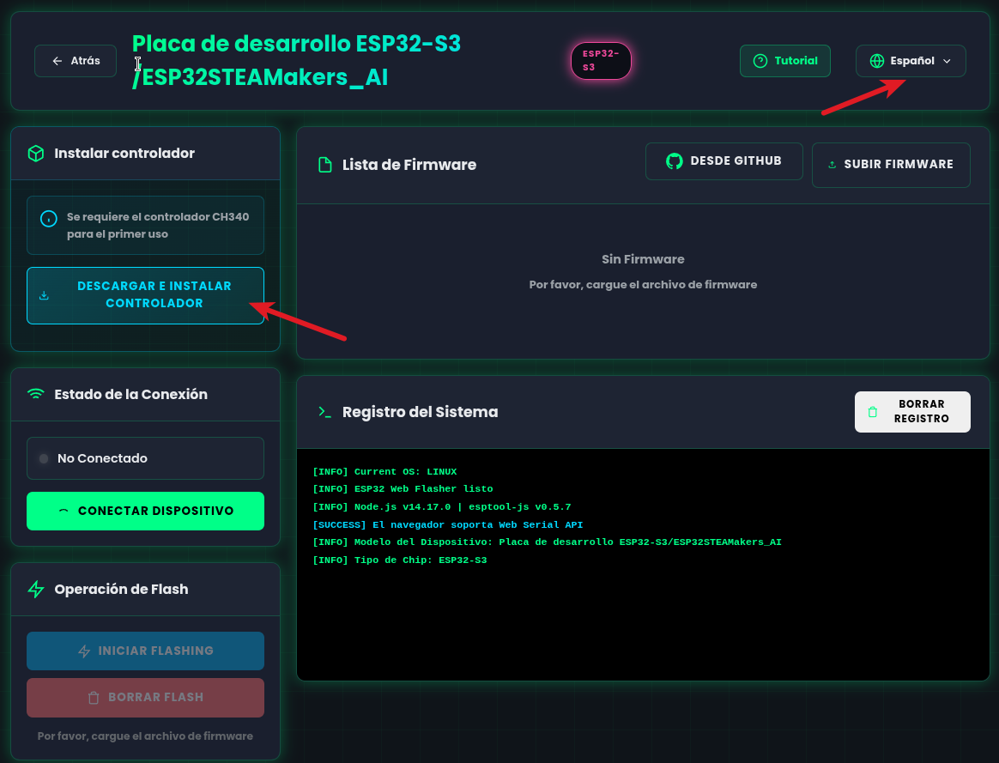{.center-img100}

La placa debiera poderse conectar sin problemas y mostrar el siguiente aspecto:

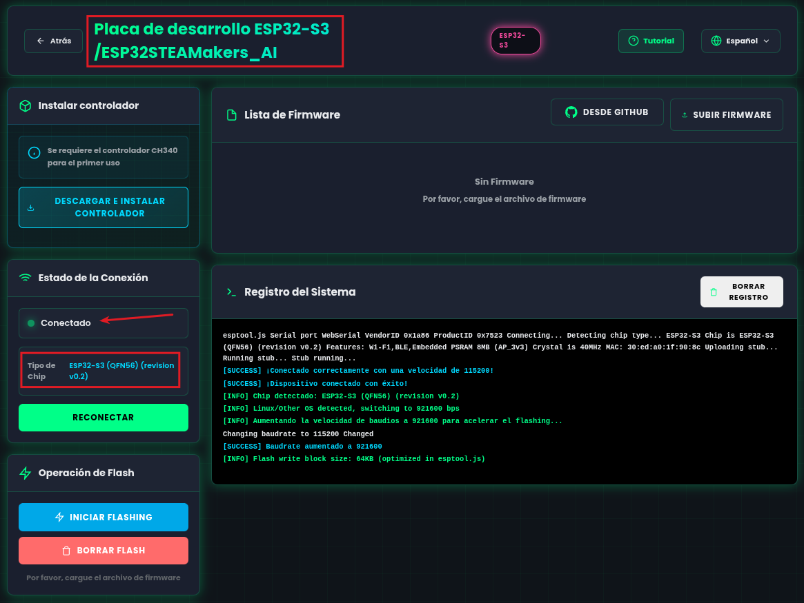{.center-img100}

Si no se conecta:

* Prueba con otro cable USB
* Prueba otro puerto USB
* Reinicia el ordenador

### Montaje del kit y alimentación
La placa puede alimentarse directamente mediante:

* El cable USB-C conectado al ordenador
* Con alimentación externa (no apto para programar)

Para montar los módulos de tu kit es necesario:

* Desconectar la placa de la alimentación
* Conectar los módulos con cuidado
* Revisar que estén bien conectados y que respetan la orientación
* Volver a conectar la placa

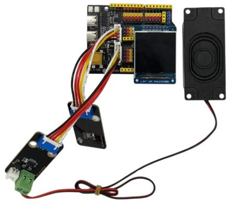{.center-img75}

El kit consta de los 5 elementos imprescindibles:

* 1 ESP32 STEAMakers AI
* 1 Pantalla TFT de 240x240 px
* 1 Altavoz
* 1 Amplificador SPI
* 1 Micrófono SPI

Hay que fijarse detalladamente en la polaridad y nomenclatura de las conexiones ya que si no las hacemos correctamente existe la posibilidad de romper algún elemento al alimentarlo.

### Carga del firmware
Antes de programar la placa, es necesario cargar el firmware. Para lo que seguiremos los siguientes pasos generales:

* Abre un navegador compatible
* Accede a la [herramienta web de carga de firmware](https://flash.keyestudio.com/)

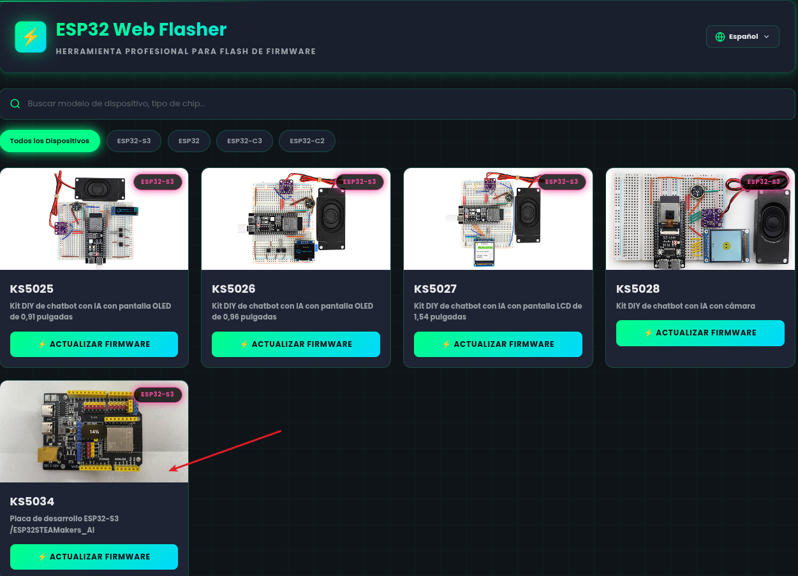{.center-img75}

* Selecciona tu placa
* Selecciona el puerto USB correspondiente en la placa
* Selecciona la última versión del firmware
* Inicia el proceso de carga
* Espera hasta que el navegador indique que ha finalizado

!!! Warning "Durante este proceso:"
    No desconectes la placa  
    No cierres el navegador

A continuación tienes un video con el paso a paso:

<iframe width="1120" height="630" src="https://www.youtube.com/embed/JXXCjN6287A?si=4rYWrsKXgVRQqGXv" title="YouTube video player" frameborder="0" allow="accelerometer; autoplay; clipboard-write; encrypted-media; gyroscope; picture-in-picture; web-share" referrerpolicy="strict-origin-when-cross-origin" allowfullscreen></iframe>

Al final deben aparecer los siguientes mensajes:

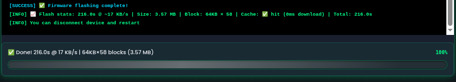  

### Conexión WiFi
Una vez cargado el firmware es necesario resetear la placa. Para resetearla podemos hacerlo de dos maneras: pulsando el botón de reset o desconectando y conectando el cable USB.

Veremos que aparecen en la pantalla de la placa estos dos datos:

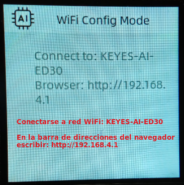  

Para poder conectar la placa a una red WiFi es necesario, primero, conectarse a la red que nos indica en “Connect to:” (KEYES-AI-ED30) y, después, introducir en el navegador la IP que nos indica en “Browser“ (http://192.168.4.1).

Una vez hecho esto debería salirnos una página similar a esta:

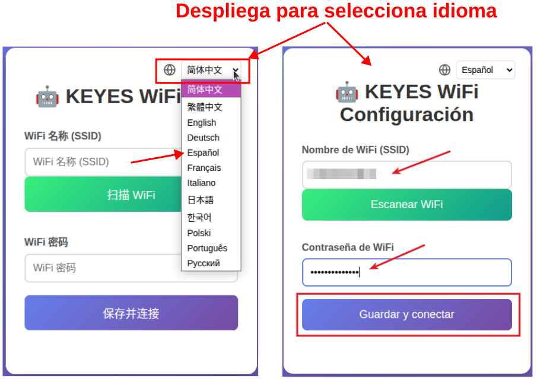  

Aquí es donde debemos establecer los datos de nuestra propia red WiFi para dotar de conexión a internet a la placa.

!!! Warning "IMPORTANTE"
    !!! Note ""
        Es necesario recordar que el ESP32-S3 soporta solamente redes **Wi-Fi de 2.4GHz**

Tras unos instantes nos aparecerá en pantalla el siguiente mensaje:

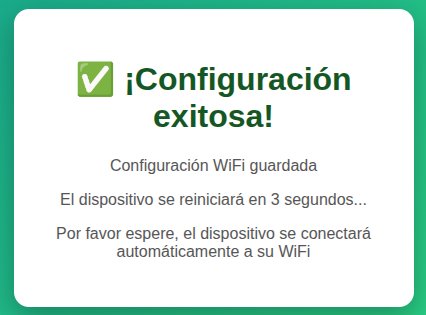  

Y lo único que tienes que hacer es seguir las indicaciones del mensaje, es decir, que la placa se resetea automáticamente y la placa con el nuevo firmware queda conectada a nuestra red Wi-Fi.

Si no ocurre el reseteo, hay que resetear la placa manualmente, y ahora nos debe salir un código de 6 dígitos en la pantalla de la placa.

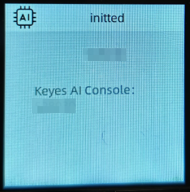  
<b>Copia el código de 6 digitos para usarlo posteriormente</b>

Ya tenemos todo listo para ir al siguiente paso, que es crear nuestro primer agente.

## **Vinculación con la plataforma AI**
### Configuración de ai.keyestudio.com
El primer paso es registrarse, con este [enlace](https://ai.keyestudio.com/register) podrás crear tu usuario utilizando un correo.

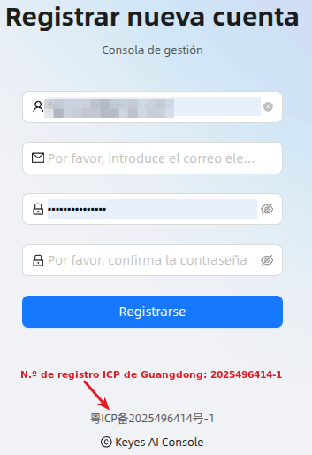  

### Creación de un agente
Un agente define cómo se comporta la inteligencia artificial y personalizarlo nos permitirá adaptar ese comportamiento a la funcionalidad que le queramos dar, por ejemplo, éste puede comportarse como un informador de noticias, como un experta ingeniera o incluso como un amigo simpático.

Se puede configurar:

* El rol del agente
* El lenguaje y el tono
* El modelo de inteligencia artificial que utilizará

Una vez identificados la página nos presenta una bienvenida que, configurada en español, tiene el siguiente aspecto:

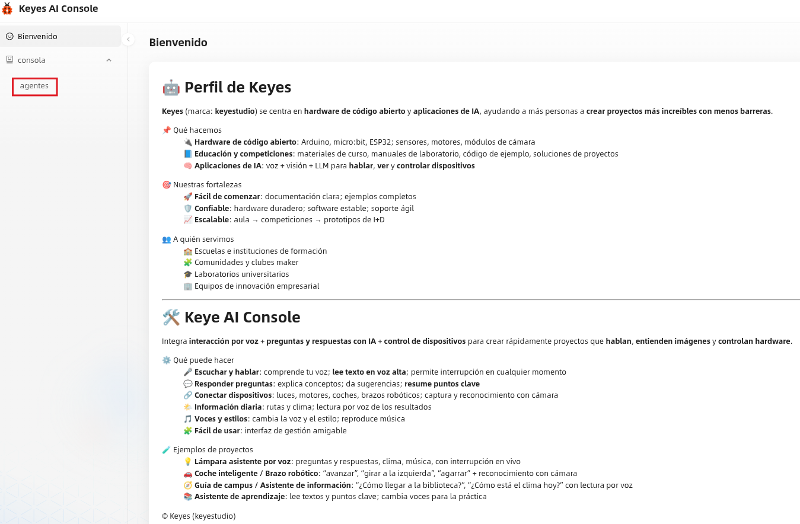  

Los agentes están disponibles en la consola, como se ve en la imagen anterior.

Una vez creado, es necesario vincular la placa. Abrimos agentes y veremos algo como:

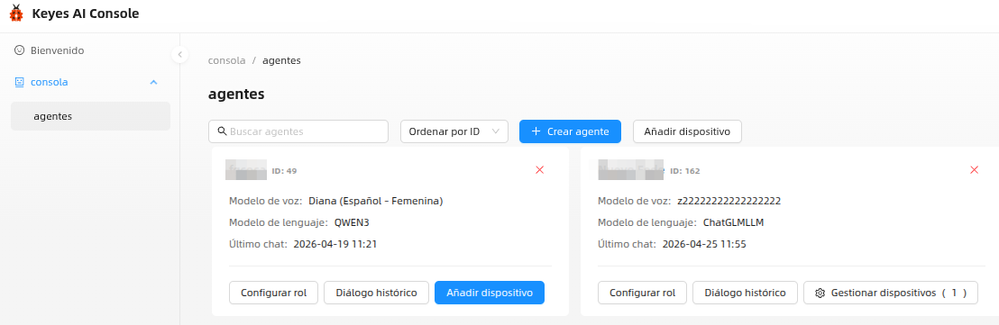  

Pulsando en “Añadir Dispositivo” se abrirá un cuadro donde debemos introducir nuestro código de 6 dígitos que anotamos anteriormente:

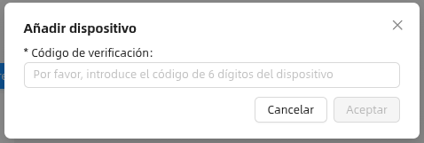  

Una vez añadido el dispositivo ya podemos crear un agente. En la imagen vemos el agente 'prueba' recien creado.

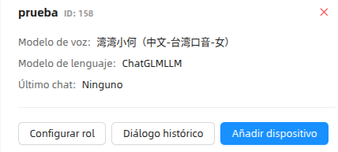  

Pulsamos en 'configurar rol' y seleccionamos las opciones que nos interesen y ya lo tenemos todo preparado, ¡comenzamos a hacer algunas pruebas!

## **Primeras pruebas**
### Verificació inicial
Antes de realizar ninguna prueba avanzada, comprueba:

* Que la placa se enciende correctamente
* Que está conectada a la red Wi-Fi
* Que la plataforma reconoce el dispositivo

  

Cuando se muestra 'Pulsar' debes accionar el pulsador 'BOOT' para que se establezca la conexión entre la placa el agente creado en ai.keyestudio.com. Cuando dicha conexión se relice ya puedes iniciar la conversación con el chatbot.

### Primera prueba:chatbot
La primera prueba propuesta es un chatbot.

Esta prueba permite comprobar:

* La comunicación placa ↔ plataforma AI
* Que el firmware funciona correctamente
* Que el agente responde cómo se espera

Si no obtienes respuesta:

* Revisa la conexión a Internet
* Comprueba la configuración del agente
* Reinicia la placa y vuelve a intentarlo

El agente mantiene un histórico de los diálogos mantenidos que se pueden ver como texto o borrarlos.

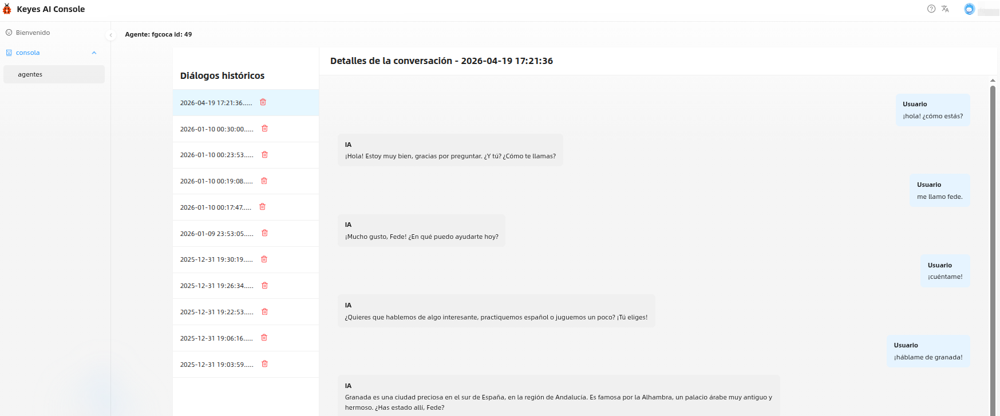{.center-img100}

