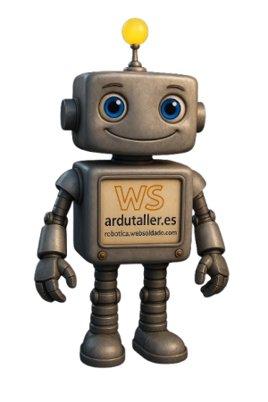

En esta página encontrarás una recopilación de recursos básicos relacionados con la placa ESP32 STEAMakers AI, pensados ​​para dar apoyo durante el trabajo con las guías y actividades de la web.

Los materiales disponibles ayudarán a ampliar información, resolver dudas concretas y seguir aprendiendo, y se irán ampliando progresivamente a medida que se vayan incorporando nuevos contenidos y proyectos.

{ align=right }

**ARDUTALLER** 

 Los contenidos de **Ardutaller** están pensados ​​para facilitar el aprendizaje, con explicaciones claras y orientadas al uso educativo y práctico.

Estos recursos ayudan a **entender mejor el funcionamiento de los productos** y a desarrollar actividades y proyectos de forma guiada.

[**Presentación de la placa**:](https://www.ardutaller.com.es/steamakers/esp32steamakers-ai)

[**Manual en Español**:](https://docs.google.com/document/d/1DhM9TOxPvbo_rmasO_L4B3AARezSWGT0ukBRjAOVnVw/edit?tab=t.0)

**STEAMakersBlocks** 

**STEAMakersBlocks** es la plataforma de **programación por bloques** del ecosistema STEAMakers, con vídeos y manuales pensados ​​para facilitar el aprendizaje de la programación y la electrónica con placas ESP32.

Muchos de los materiales desarrollados para la **ESP32 STEAMakers** (versión anterior) son totalmente compatibles y resultan muy útiles para empezar a trabajar con la placa, especialmente en los primeros proyectos y conceptos básicos.

[**Guías STEAMakersBlocks:**](https://www.steamakersblocks.com/web/site/doc)

[**Video introductorio ESP32 STEAMakers:**](https://youtu.be/ER9cysiQQ0A?si=CfaTO6fK5XW5raRW)
